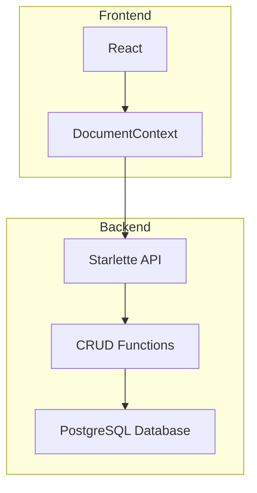

## Document Management Application: Architecture and API Documentation

### Overview

This is a full-stack document management application designed for simplicity and ease of use. It consists of a React frontend, a Starlette-based Python backend API, and a PostgreSQL database.

### Architecture



The architecture follows a classic client-server model:

- **Frontend (React):**
    - Fetches document data from the backend API.
    - Displays documents in a draggable grid with image previews.
    - Allows reordering of documents.
    - Sends updated document positions to the backend for persistence.
- **Backend (Starlette):**
    - Exposes RESTful API endpoints for document management.
    - Handles database interactions using SQLAlchemy.
    - Ensures data validation with Pydantic.
- **Database (PostgreSQL):**
    - Stores document information (type, title, position).

### API Design

The API follows REST principles, using standard HTTP methods (GET, POST, PUT) and intuitive resource paths:

- **GET /documents:** Fetches all documents ordered by position.
- **POST /documents:** Adds a new document.
- **PUT /documents/update_positions:** Updates the positions of multiple documents.

#### Data Formats

- **Request/Response Body:** JSON
- **Example Request (PUT /documents/update):**

```json
{
  "documents": [
    {"id": 1, "position": 2},
    {"id": 3, "position": 0},
    {"id": 2, "position": 1}
  ]
}
```

### Setup and Usage

1. **Prerequisites:**
   - Docker and Docker Compose installed.

2. **Clone the Repository:**
   ```bash
   git clone https://github.com/zakeer/zania-test
   ```

3. **Start the Application:**
   ```bash
   docker-compose up --build 
   ```

4. **Access the Frontend:** Open your browser and navigate to `http://localhost:3000`.

5. **Interact with the API:** You can use tools like `curl` or Postman to send requests to the backend API (available at `http://localhost:8080`).

### Design Decisions

- **Starlette:** Chosen for its performance, asynchronous capabilities, and ease of use.
- **PostgreSQL:**  Selected for its robustness, reliability, and suitability for storing structured data.
- **SQLAlchemy:** Provides a clean and expressive way to interact with the database using Python objects.
- **Pydantic:** Enforces data validation for incoming requests, ensuring data integrity.
- **Docker:** Simplifies deployment and ensures consistency across different environments.

### Future Considerations

- **Authentication and Authorization:** Implement user authentication and authorization mechanisms for secure access to the documents.
- **Document Versions:** Store multiple versions of a document to track changes over time.
- **Full-Text Search:** Add search functionality to find documents based on their content.
- **Collaboration:** Enable multiple users to work on documents simultaneously.

